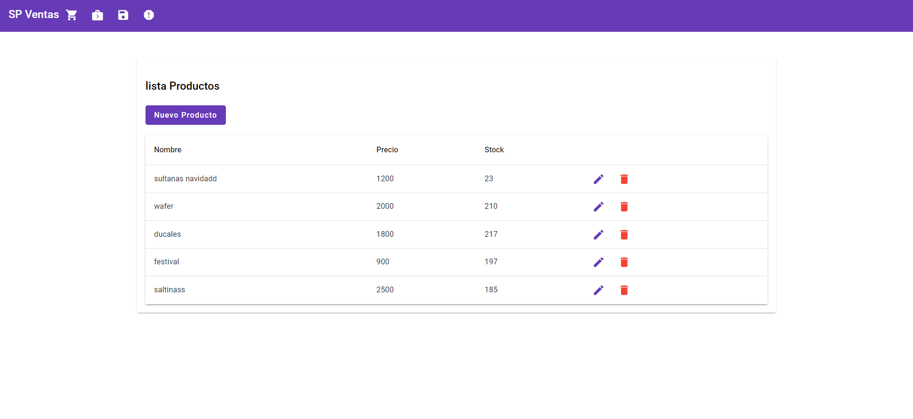
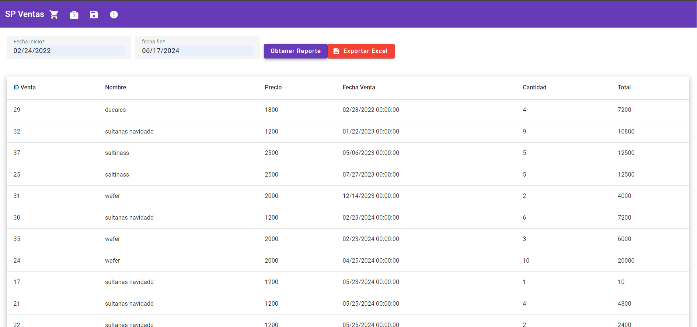
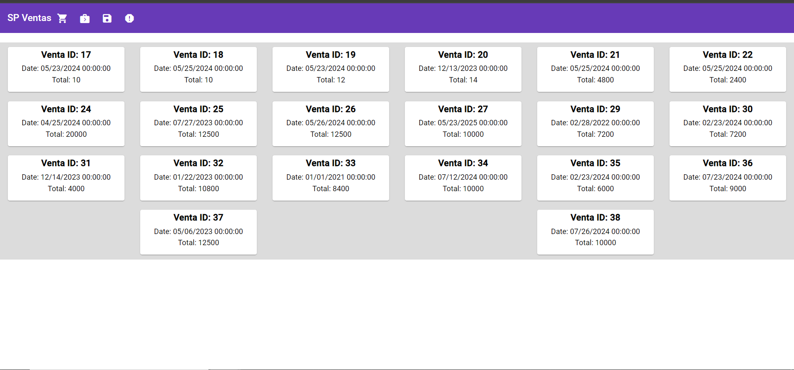

# Sistema de Ventas con Inventario

## Descripción

Este es un sistema de ventas diseñado para gestionar el inventario de productos, registrar ventas, generar reportes y exportar información relevante. Está desarrollado con .NET en el backend, SQL Server para la base de datos y Angular para el frontend.

## Características

- **Gestión de Inventario**: Agregar, editar y eliminar productos.
- **Registro de Ventas**: Realizar ventas y registrar detalles.
- **Historial de Ventas**: Visualizar y filtrar ventas pasadas.
- **Reportes**: Generar reportes de ventas y de inventario.
- **Exportación de Reportes**: Exportar reportes en formatos como CSV y PDF.

## Tecnologías Utilizadas

- **Backend**: .NET Core
- **Base de Datos**: SQL Server
- **Frontend**: Angular
- **Otros**: Entity Framework, Bootstrap

- ## Capturas de Pantalla

## Capturas de Pantalla

### Página de Inicio



### Registro de Ventas



### Historial de Ventas




## Instalación

### Clonar el repositorio

```bash
git clone https://github.com/edwarenrique2704/ecommerce.git


Configurar el frontend
Navega a la carpeta del frontend:

cd frontend

Instala las dependencias:

npm install

Inicia la aplicación:
ng serve

Uso
Abre tu navegador y ve a http://localhost:5169 para acceder a la aplicación.
Regístrate o inicia sesión para comenzar a explorar los productos.

Licencia
Este proyecto está licenciado bajo la Licencia MIT.

Contacto
Si tienes alguna pregunta, no dudes en contactarme:

Edward garcia
edwarenrique2704
